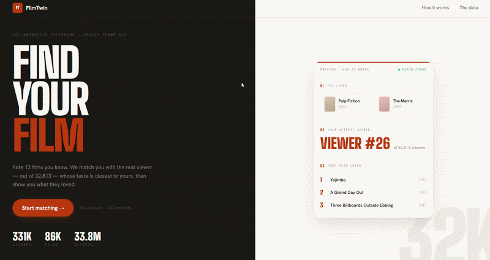

# 🎬 FilmTwin

**Find your film twin. Get recommendations based on your taste.**

**[Try FilmTwin →](https://filmtwin.vercel.app)**

<!-- DEMO GIF: replace the path below with your uploaded GIF (drag into GitHub editor to get the URL) -->


---

FilmTwin asks you to rate 12 films, finds the MovieLens viewer whose genre preferences are closest to yours, and recommends films that viewer rated highly — films you haven't seen yet.

No account. No tracking. Just your taste.

---

## How it works

```
Rate 12 films
      ↓
Build your 19-dimensional taste profile
      ↓
Find your closest Film Twin (323,733 viewers, pgvector HNSW)
      ↓
Blend recommendations from ALS-trained neighbours
      ↓
Discover your next films
```

The application combines:
- **Apache Spark ALS** for collaborative filtering
- **19-dimensional genre embeddings** for cold-start taste matching
- **pgvector + HNSW** for similarity search across 323K+ MovieLens viewers
- **Hybrid ranking** combining collaborative and genre signals (0.6 × ALS + 0.4 × genre)

Model training happens entirely offline. The deployed application performs lightweight vector retrieval and hybrid ranking at request time.

---

## Results

| Metric | Value |
|---|---|
| MovieLens viewers indexed | 323,733 |
| Hybrid NDCG@10 | **0.0237** |
| Improvement vs ALS alone | **+14.5%** |
| Hit Rate@10 | **16.4%** |
| ALS RMSE | 0.82 (random baseline: 0.97) |

The deployed experience uses 12 ratings as a balance between onboarding length and taste-profile stability.

📊 **[Full evaluation results → filmtwin.vercel.app/model](https://filmtwin.vercel.app/model)**

---

## Tech stack

| Layer | Technology |
|---|---|
| ML | Python · PySpark · Apache Spark ALS |
| Search | Supabase · pgvector · HNSW |
| Frontend | Next.js · TypeScript |
| Deployment | Vercel |

---

## Evaluation

The project includes offline experiments covering Precision@10, Recall@10, NDCG@10, Hit Rate@10, cold-start performance across K=5–30 ratings, popularity bias, catalog coverage, novelty, intra-list diversity, and Film Twin stability.

See [docs/evaluation.md](docs/evaluation.md) for methodology and full tables, or the live [model dashboard](https://filmtwin.vercel.app/model).

---

## Project structure

```
src/video_recommender/
├── train_als.py       # Spark ALS training
├── evaluate.py        # Offline evaluation
├── cold_start.py      # Cold-start experiment
├── user_profiles.py   # Genre embeddings → Supabase
└── bias_audit.py      # Popularity bias audit

frontend/app/
├── page.tsx           # Rating flow → matching → results
└── model/page.tsx     # Model dashboard
```

---

## Run locally

```bash
uv sync
uv run python -m video_recommender.train_als
uv run python -m video_recommender.evaluate
uv run python -m video_recommender.cold_start

cd frontend && npm install && npm run dev
```

See [docs/development.md](docs/development.md) for the complete setup including Supabase configuration.

---

## Limitations

- ALS trained on a 10% user sample (32,813 users) for computational efficiency
- Film Twin matching uses 19 genre dimensions — does not capture director, actor, era, or semantic preferences
- Cold-start evaluation uses simulated new users from MovieLens, not live feedback
- MovieLens ratings skew toward Western, English-language cinema
- No persistent user profile — recommendations are session-only
- Twin stability is low (2–7%) across K values; the Film Twin is the nearest neighbour in genre space, not a uniquely determined match

---

## Dataset

[MovieLens ml-latest](https://grouplens.org/datasets/movielens/latest/) — 33.8M ratings, 330,975 users, 86,537 films (GroupLens, University of Minnesota).

> F. Maxwell Harper and Joseph A. Konstan. 2015. The MovieLens Datasets: History and Context. ACM TiiS 5, 4. https://doi.org/10.1145/2827872
